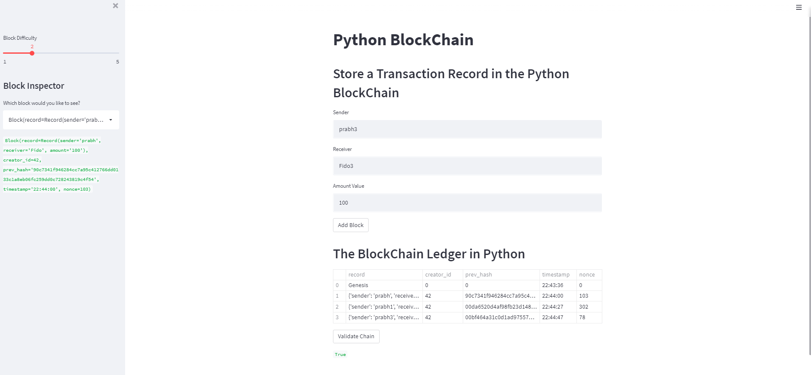

# PyChain Ledger

Blockchain-based ledger system, complete with a user-friendly web interface. This ledger allows partners to conduct financial transactions (that is, to transfer money between senders and receivers) and to verify the integrity of the data in the ledger.
## Files

Following files are in repository:

pychain.py
## Instructions

Open the [`pychain.py` file]. Notice that the `PyChain` ledger includes the functionality to create blocks, perform the proof of work consensus protocol, and validate blocks in the chain.

The steps  are divided into the following sections:

1. Creating a Record Data Class

2. Modifying the Existing Block Data Class to Store Record Data

3. Adding Relevant User Inputs to the Streamlit Interface

4. Testing the PyChain Ledger by Storing Records

#################################################################################################################################################################################